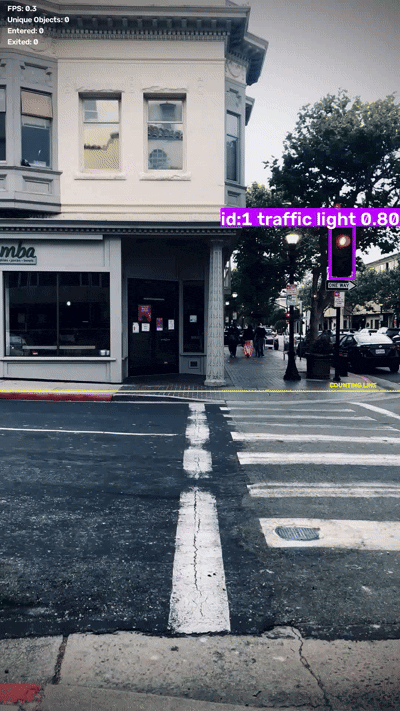

# Real-Time Vision Tracker

A real-time computer vision application built with **YOLO26**, **OpenCV**, and multi-object tracking.

The system detects and tracks objects across video frames, maintains persistent IDs, analyzes movement, counts line crossings, records object statistics, and benchmarks model/tracker performance.

## Demo



## Features

- Real-time YOLO object detection
- Multi-object tracking with persistent IDs
- TrackTrack and ByteTrack support
- Object confidence filtering
- Multi-frame object confirmation
- Unique object counting
- Per-class object statistics
- Movement trails
- Direction-aware line crossing
- Entered / exited counters
- Automatic cleanup of inactive tracks
- Live FPS display
- Processed video export
- Command-line configuration
- CSV performance benchmarking
- Automated analytics tests

## System Architecture

```mermaid
flowchart TD
    A[Webcam / Video] --> B[OpenCV]
    B --> C[YOLO26 Object Detection]
    C --> D[Multi-Object Tracker]
    D --> E[Track IDs]

    E --> F[Object Confirmation]
    E --> G[Movement History]
    E --> H[Line Crossing Analysis]

    F --> I[Unique Object Counts]
    G --> J[Movement Trails]
    H --> K[Entered / Exited Counts]

    I --> L[Visualization]
    J --> L
    K --> L

    L --> M[Live Display]
    L --> N[Processed MP4]

    C --> O[Performance Benchmark]
    D --> O
    O --> P[CSV Results]